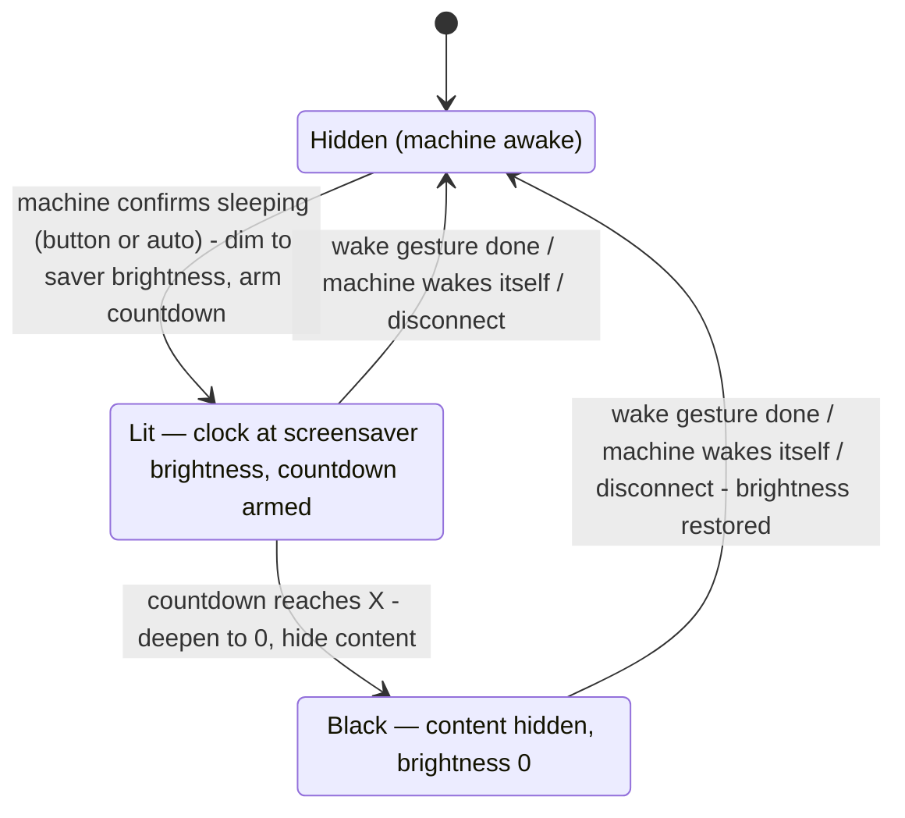

# Screen-off after sleep — timed black-out for the sleep screen

Status: Implementation adapted on 2026-09-22. The interaction update below supersedes the original proposal's tap/countdown behavior.

## Interaction update — 2026-09-22

- A single stationary tap on the black screen restores the clock at the configured screensaver brightness, without waking the machine.
- Revealing the clock refreshes its time, resumes its ticker and starts a fresh screen-off countdown. Tapping an already-visible clock does not restart the countdown.
- A one-second hold wakes the machine from either state. Releasing after a completed hold does not reveal the clock or queue another brightness write.
- Swipes, cancelled touches and multi-touch do not reveal the clock or wake the machine.
- Clock and hint animations remain absent while blacked out. Restoring the clock never replaces the saved normal-screen brightness.
Date: 2026-09-20
Author: Pi coding agent (drafted for the skin owner)
Reviewers: skin owner
Related: investigation sessions in this repo's chat history (Bestpresso sleep flow, decaid display controller, Streamline.js screensaver, de1app heritage)

## TL;DR

Pressing sleep dims the tablet to 7% and leaves the clock saver lit for as long as the machine sleeps, because decaid's wake-lock default (`keepAwake: true`) keeps the panel on and the skin never darkens past that dim step. No skin can power the panel off — decaid exposes no such command — so this design adds a "Screen off after" preference: X seconds after the saver appears, the skin deepens the dim to brightness 0 and blacks out the saver's content, the same end-state Streamline.js and the classic de1app reach with their black screensaver. Waking stays the existing 1-second hold, and every existing restore path returns the pre-sleep brightness unchanged.

## Context and Problem

Verified facts from the code:

- The sleep button calls `toggleSleep()` (`src/features/brew/useBrewingData.ts:1083`), which sends `PUT /machine/state/sleeping`, activates the full-screen saver and dims the display to the `screensaverBrightness` preference (default 7%, `src/features/settings/bestpressoPreferences.ts:33`).
- The saver (`src/features/sleep/SleepWakeScreen.tsx`) renders the logo, a clock refreshed every 30 s, and a pulsing "Touch and hold to wake" hint. It stays mounted for as long as the machine sleeps.
- The screen never blanks on its own: decaid holds the wake lock whenever its `keepAwake` setting is true — the default. Its display controller short-circuits to "wake lock on" before it ever considers machine state (decaid `lib/src/controllers/display_controller.dart`, `_evaluateWakeLock`), and its own test suite asserts "keeps wake-lock enabled while machine sleeps". Bestpresso surfaces this setting ("Keep screen awake") but the sleep flow never touches it.
- No skin can turn the panel off. Decaid's display API offers brightness (0–100) and a wake-lock override (POST = force on, DELETE = return to auto-management); there is no force-off command (decaid `doc/Skins.md`, Display Control). Bestpresso already ships an unused REST wrapper for the override (`src/api/decaid/client.ts:169`).
- Precedent: Streamline.js has a "Black screen" screensaver option — a full black cover at brightness 0, raised as soon as the machine confirms sleeping, tap to wake (streamline-js `src/modules/api.js`, `src/modules/ui.js`). The classic de1app screensaver is the same pattern (de1app `de1plus/utils.tcl`, `black_saver.jpg`). Streamline's source states the ceiling plainly: "a black cover at 0 is as dark as a sleeping tablet gets".
- Brightness restore is doubly covered on wake: Bestpresso's `restoreDisplay()` returns the saved pre-dim level, and decaid itself restores the remembered pre-sleep brightness when the machine wakes with requested brightness 0 (`display_controller.dart`, `_syncBrightnessForMachineState`). The two write the same value.

**Problem statement:** when the user presses sleep, the clock saver stays lit at 7% for as long as the machine sleeps — often all day — and the user wants the saver visible for a chosen window, with the screen dark afterwards.

## Goals

- Pressing sleep shows the saver, then the screen goes black after a user-chosen delay; the blackout request fires within 1 s of the configured X.
- X is configurable in the skin's settings: 0–3600 seconds, step 15 (confirmed — OQ-2).
- Works with all current defaults: no required changes to decaid settings or the tablet's operating-system (OS) settings.
- Waking from black restores the pre-sleep brightness and uses today's existing 1-second hold; no new gesture.
- Zero behavior change for users who leave the feature off (default 0 = disabled, confirmed — OQ-1)..

## Non-goals

- True panel power-off — impossible from a skin; the wake-lock route is documented in Alternatives and deferred to a follow-up (confirmed — OQ-6).
- Changing decaid's `keepAwake` or presence settings on the user's behalf.
- Re-raising the saver after a failed wake (existing quirk: `wakeMachine` dismisses the saver optimistically at `useBrewingData.ts:1130-1131`; unchanged by this design).
- Sending presence heartbeats (`POST /machine/heartbeat`) — a related gap in Bestpresso, but separate work.

## Proposed Design

The saver gains a third visual state. Today it is either hidden or lit (clock visible at screensaver brightness). This design adds **black**: content hidden, animations stopped, display brightness at 0.



The sleep screen has three visual states; every exit from Black flows through the existing wake-restore path (diagram omits the reload-during-sleep re-entry, which restarts at Lit — text below covers it).

### Components and responsibilities

**1. Preference — `screensaverScreenOffDelaySeconds`.** One new integer field on `BestpressoPreferences` (`src/features/settings/bestpressoPreferences.ts`), following `screensaverBrightness` exactly: default 0 = disabled (confirmed — OQ-1), where 0 means "never go black, keep today's behavior" (confirmed — OQ-3). Normalization clamps to the range 0–3600 seconds and falls back to the default on non-finite values. Stored in the existing localStorage blob; no migration, because absent fields normalize to defaults.

**2. Policy extension — `deepen(0)`.** `displayBrightnessPolicy` (`src/features/settings/displayBrightnessPolicy.ts`) gains one operation: deepen an active dim session to a lower value. It enqueues like every other write; it does nothing when no dim session is active (`if (!dimmed) return`); it writes the value and keeps `beforeSleep` untouched, so `restore()` remains exactly as it is today (returns the pre-sleep level, line 44-49). We chose a new operation over re-calling `dim()` because `dim()` deliberately refuses to re-capture while dimmed (line 35) — re-dimming must not record the saver level as the level to restore.

**3. Countdown and black state — owned by `SleepWakeScreen`.** The component already mounts exactly when the saver is shown and unmounts on every exit path. On mount it reads the delay preference (it already consumes `useBestpressoPreferences` for the clock format), arms a timer if the delay is non-zero, and on fire calls `displayBrightness.deepen(0)` and switches its visual state to black: hide the logo, clock and hint, stop the hint pulse animation, and stop the 30 s clock interval (confirmed — OQ-4). The full-screen button element stays mounted, so the 1-second hold-to-wake gesture keeps working on the black surface — the same affordance Streamline's black saver relies on. Unmount cancels the timer structurally (React cleanup), so no cancellation code is needed at the seven `setSleepScreenActive(false)` sites (`useBrewingData.ts:509, 925, 1088, 1103, 1114, 1117, 1131`) — each of which already pairs with a `restoreDisplay()` call, an invariant this design relies on.

We chose component ownership over a timer in `useBrewingData` because the data layer would need the countdown threaded through its seven sleep-exit sites — each a missed-cancellation bug — while the component's mount/unmount lifecycle guarantees arming and cancellation in one place. All display writes still go through the shared serialized policy queue, so ordering with wake's `restoreDisplay()` is preserved either way.

**4. Settings row and i18n.** A `NumberSetting` next to "Screensaver brightness" in the Display card (`src/features/settings/SettingsScreen.tsx:263`), labelled "Screen off after", with a hint explaining that 0 keeps the saver lit (confirmed — OQ-3). Keys `settings.power.screenOffAfter` / `...Hint` added to all seven locale files (`src/i18n/*/settings.ts`), matching the existing `screensaverBrightness` key pattern (`src/i18n/en/settings.ts:168-169`). The `settingsLayout.test.ts` key list gains the new label.

### Key flows

- **Sleep button (or machine auto-sleep, or a sleep from the machine's physical Group Head Controller, GHC):** snapshot confirms sleeping → existing dim to 7% + saver mounts → countdown arms → after X, deepen to 0 + black visuals. The manual path (`toggleSleep`, line 1108) and the automatic path (snapshot handler, line 919-921) already converge on the same saver activation, so the countdown needs no branch between them.
- **Wake from black:** user holds the black surface for 1 s → existing `onWake` → `wakeMachine()` sends `idle` and calls `restoreDisplay()` (line 1134). The deepen write and the restore both sit in the serialized queue, so a countdown racing a wake can never end dark-and-awake: either deepen lands first and restore then rewrites the saved level, or the screen unmounts and the timer is cancelled. Decaid's native brightness restore is the backstop if the skin's restore is lost.
- **Disconnect while sleeping:** `updateMachineConnection` (line 509-510) dismisses the saver and restores brightness — unmount cancels the countdown. Reload during sleep remounts the saver at Lit with a fresh countdown (existing behavior re-dims to 7% on the sleeping transition; the black-out simply repeats after X).
- **Touch during the countdown:** does not restart the timer. The blackout is tied to machine sleep, not to user idleness — a stray touch must not extend the window the user configured (confirmed — OQ-5).
- **Black with no visible affordance:** the surface stays the wake control, but at brightness 0 the user sees nothing indicating a hold gesture. v1 ships no reveal — the black state matches Streamline's black saver, which also shows nothing (confirmed — OQ-7).

### Contracts

`displayBrightnessPolicy` adds:

- `deepen(value: number)` — enqueue; if no dim session is active, return; else write `value`. Does not touch `beforeSleep` or `dimmed`.

Everything else in the policy is unchanged; `choose`, `replay`, `dim`, `restore` keep their current signatures and tests.

### Error handling

- The deepen write fails (API down, unsupported platform): the saver stays Lit at screensaver brightness — the same graceful posture the existing dim failure already has (`useBrewingData.ts:352-355` swallows dim errors). Black-out is a best effort, never a blocker.
- `platformSupported.brightness === false`: same as above; visual black state still hides the content, brightness stays OS-managed.
- Low-battery brightness cap (decaid caps *high* requests at 20 when battery < 30%): no interaction — 0 is below the cap, and the cap only lowers values.
- Timer throttling in a backgrounded browser tab (desktop secondary use): blackout may fire late; the primary tablet WebView is foreground, where this does not apply.

```text
ON mount of sleep screen:
  delay = preferences.screensaverScreenOffDelay
  IF delay = 0: RETURN                          // feature off, saver stays lit — OQ-3
  START timer(delay):
    ON fire, IF still mounted:
      displayBrightness.deepen(0)              // 7% -> 0, same dim session
      SET black visual state                   // hide content, stop animations + clock ticks — OQ-4
ON unmount: CANCEL timer                        // wake, disconnect, error path — restore runs elsewhere
ON hold gesture completes: onWake()             // existing path: idle + restoreDisplay
```

The guard clauses exist because the countdown must never darken an already-awake session (`deepen` checks its own dim flag) and never leak past the saver's lifetime (unmount cancels). A deepen that fires between unmount and restore is impossible: the queue serializes both writes in submission order, and an unmounted screen stops submitting.

## Alternatives Considered

**B — Wake-lock release after X (true OS screen-off).** After X, call the existing dead wrapper `setDisplayWakeLock(false)` (DELETE `/display/wakelock`) so decaid's auto-management releases the wake lock and Android blanks the panel for real. Trade-offs: it cannot work under the default `keepAwake: true` (decaid's `_evaluateWakeLock` short-circuits before considering machine state, so DELETE is a no-op); keeping the saver lit for X then requires POSTing the *force-on* override first; the blank still happens on the OS timeout's schedule, roughly max(X, OS-timeout-since-last-touch), so X is a floor, not a promise; and the user must also change "Keep screen awake" and the tablet's display timeout. Why it lost as the primary: it fails with all defaults and cannot deliver a predictable X. It survives as a deferred companion for users who set `keepAwake: false` (deferred to a follow-up — OQ-6).

**C — Flip `keepAwake` off when sleeping, restore on wake.** The skin would write a decaid-global setting from a single button press. Trade-offs: it mutates a setting other surfaces (decaid's native dashboard, other tablets) observe; a crash mid-sleep strands the setting off-screen-off; and with `keepAwake: false` the screen also blanks on the OS timeout whenever the machine merely disconnects. Why it lost: global side effects from a local gesture, for no benefit the black cover cannot deliver.

**D — Do nothing; document `keepAwake: false` + OS timeout.** This already produces "saver shows, screen blanks eventually" with zero code, because decaid's auto-management releases the wake lock the moment the machine sleeps (confirmed in its controller tests). Why it lost: the delay lives in the tablet's OS settings, not the skin; the user asked for a skin-configurable X; and the blanking also applies during any disconnected session. The doc keeps it as the no-code fallback for users who want true panel-off.

**E — Immediate black only (Streamline parity, no delay).** A "black screensaver" toggle matching Streamline's option exactly, without the timer. Why it lost: it is subsumed — a small X is near-immediate — and shipping both a toggle and a delay creates two overlapping controls for one behavior. If near-immediate black matters, X's minimum step (15 s) covers it (step confirmed — OQ-2).

## Cross-cutting Concerns

- **Battery and burn-in:** black at brightness 0 stops the all-day clock; stopping the clock interval and pulse animations in the black state also removes the saver's periodic work. The panel itself stays powered (liquid-crystal display, LCD, backlight at its minimum) — honest ceiling, stated in the settings hint and README.
- **Backward compatibility:** default 0 disables everything; the preference blob gains a field that existing installs normalize to the default. `deepen` changes no existing policy behavior; the existing `displayBrightnessPolicy.test.ts` suite pins `dim`/`restore`.
- **Documentation:** README.md:52 still describes the pre-`408f73e` behavior ("brightness to 0") — fix it in the same release to describe the dim → timed black-out sequence.
- **Tests:** policy tests for `deepen` (no dim session, deepens active session, restore after deepen returns the pre-sleep level); preference normalization clamp; a source-text assertion in the repo's existing style that `SleepWakeScreen` arms only when delay > 0 and cancels on unmount; the `settingsLayout.test.ts` key list.

## Rollout and Migration

Ships behind the preference default 0 (off) — no flag, no migration, no data-shape change; existing installs keep their behavior byte-for-byte until the user opts in. Rollback is a release revert; the persisted preference is inert in older releases. Watch after release: reports of "black screen will not wake" (mitigations: hold gesture stays mounted, restore is dual-covered by decaid's native pre-sleep restore) and any interaction with low-battery brightness capping on real tablets.

## Open Questions

| ID | Question | Decision | Confirmed | Can change |
|---|---|---|---|---|
| OQ-1 | Default delay: 0 (opt-in) or a shipped value such as 300 s? | 0 — opt-in; the feature is the user's own ask, not a global default | 2026-09-20, skin owner | the whole rollout |
| OQ-2 | Units: seconds or minutes? | Seconds, 0–3600, step 15 | 2026-09-20, skin owner | a section |
| OQ-3 | What does 0 mean: disabled or "go black immediately"? | Disabled; near-immediate is X = step size | 2026-09-20, skin owner | a section |
| OQ-4 | Black-state content: hide content and stop animations/clock, or leave the clock rendering invisibly? | Hide + stop | 2026-09-20, skin owner | a section |
| OQ-5 | Does a touch during the countdown restart the timer? | Fixed window, tied to machine sleep | 2026-09-20, skin owner | a section |
| OQ-6 | Ship the companion true-off mode (wake-lock override dance, requires `keepAwake: false`) now or defer? | Defer to a follow-up; Alternative B documents the design | 2026-09-20, skin owner | a section |
| OQ-7 | At black, should a first touch briefly reveal the clock? | None in v1 — hold-to-wake is documented in the README and matches Streamline's precedent | 2026-09-20, skin owner | a section |

## Revision Log

- 2026-09-20 | First draft; 7 open questions, 0 confirmed | count 0/7.
- 2026-09-20 | OQ-1…OQ-7 confirmed — all recommendations accepted; preference field name settled to `screensaverScreenOffDelaySeconds` | count 7/7.
- 2026-09-20 | Implemented: preference + normalization, `deepen(0)` policy operation, saver countdown/black state, settings row, 7 locales + provenance docs, 36 new/updated test assertions, README sleep paragraph fixed. All 593 tests, i18n parity, lint and build pass.

## References

Code read for this design (Bestpresso): `src/features/brew/useBrewingData.ts` (sleep flow: lines 352-359, 495-511, 917-926, 1083-1160), `src/features/sleep/SleepWakeScreen.tsx`, `src/features/sleep/wakeHoldGesture.ts`, `src/features/settings/bestpressoPreferences.ts`, `src/features/settings/displayBrightnessPolicy.ts`, `src/features/settings/displayBrightness.ts`, `src/features/settings/SettingsScreen.tsx:263`, `src/features/settings/settingsProtocol.ts`, `src/api/decaid/client.ts:169-172`, `src/api/decaid/types.ts` (DisplayState), `src/i18n/en/settings.ts:168-185`, `README.md:52`, `test/displayBrightnessPolicy.test.ts`, `test/settingsLayout.test.ts:22`.

External sources: decaid (`decentespresso/decaid`): `lib/src/controllers/display_controller.dart` (`_evaluateWakeLock`, `_syncBrightnessForMachineState`), `test/controllers/display_controller_test.dart` (keepAwake group), `test/webserver/settings_handler_test.dart` ("keepAwake defaults to true"), `lib/src/import/parsers/settings_tdb_parser.dart:94`, `doc/Skins.md` (Display Control, Presence). Streamline.js (`decentespresso/streamline-js`): `src/modules/api.js` (black saver, `SAVER_BRIGHTNESS_DEFAULT`, wake-lock and heartbeat wrappers), `src/modules/ui.js` (`activateScreensaver`), `src/modules/screensaver-policy.js`. de1app: `de1plus/utils.tcl` (black_saver).
